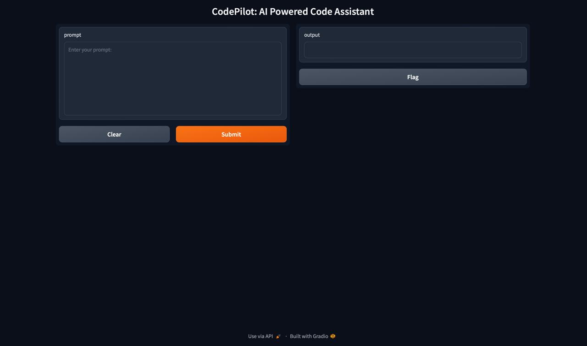
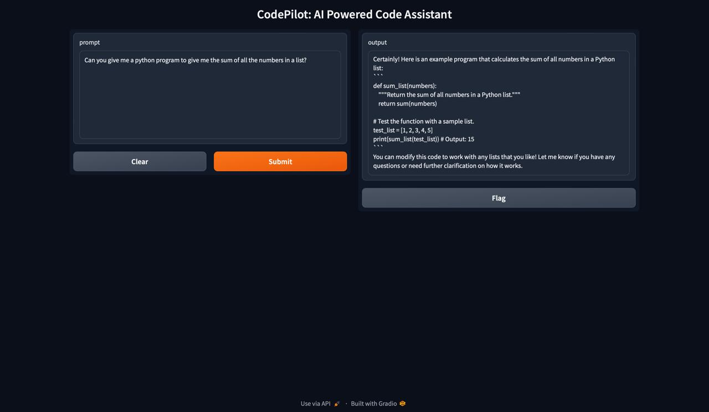

# CodePilot: AI Powered Code Assistant 🤖

CodePilot is an AI-powered code assistant that uses the Code Llama model to generate and assist with code based on user prompts. It features a web interface built with Gradio for easy interaction with the model.

## Features
- **Interactive Interface**: Enter prompts and get responses from the customised Code Llama model.
- **Contextual Responses**: Prompts are accumulated to provide contextually relevant responses.

## Screenshots

Here are some screenshots of the application:

1. **Home Screen**

    <!-- Replace with actual screenshot -->

2. **Response Example**

    <!-- Replace with actual screenshot -->


## Installation

1. **Clone the Repository**

   ```bash
   git clone https://github.com/yourusername/codepilot.git
   cd codepilot
   ```

2. **Install Ollama**

   Follow the instructions on the [Ollama website](https://ollama.com) to install Ollama on your machine.

3. **Download Code Llama Model**

   Download the Code Llama model using Ollama by running the following command.
   ```bash
   ollama run codellama
   ```

5. **Set Up the Model with Ollama**

   Use Ollama to create and configure the Code Llama model for your project. Run the following command:

   ```bash
   ollama create CodePilot -f modelfile
   ```

   Ensure that `codePilot` is the name of your configuration file or model setup file. This command will configure Ollama to use the downloaded Code Llama model.


6. **Install Dependencies**

   Create a virtual environment and install the required libraries:

   ```bash
   python -m venv venv
   source venv/bin/activate 
   pip install -r requirements.txt
   ```

7. **Run the Application**

   Start the Gradio interface with:

   ```bash
   python app.py
   ```

8. **Access the Application**
   
   Open your web browser and navigate to `http://localhost:7860` to start interacting with CodePilot.
